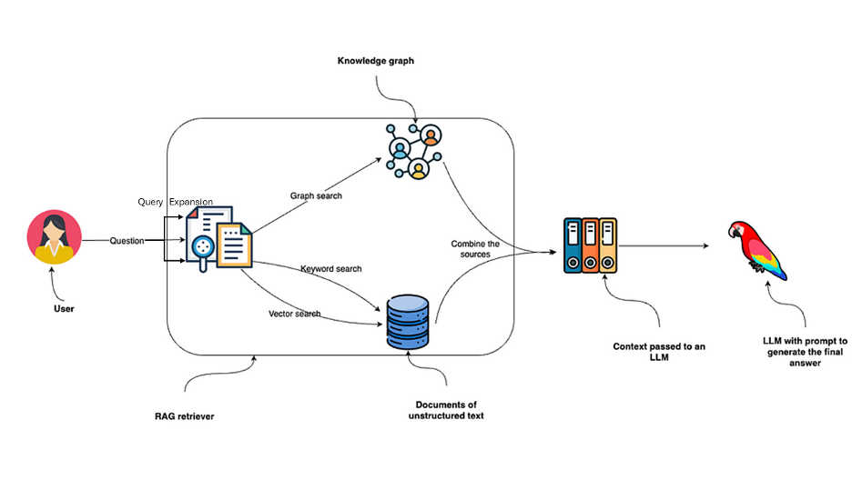
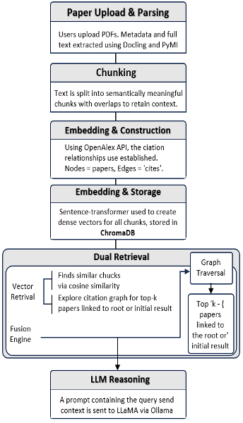
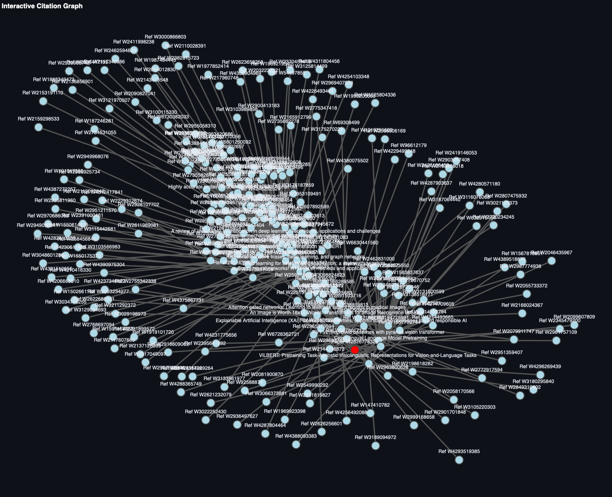
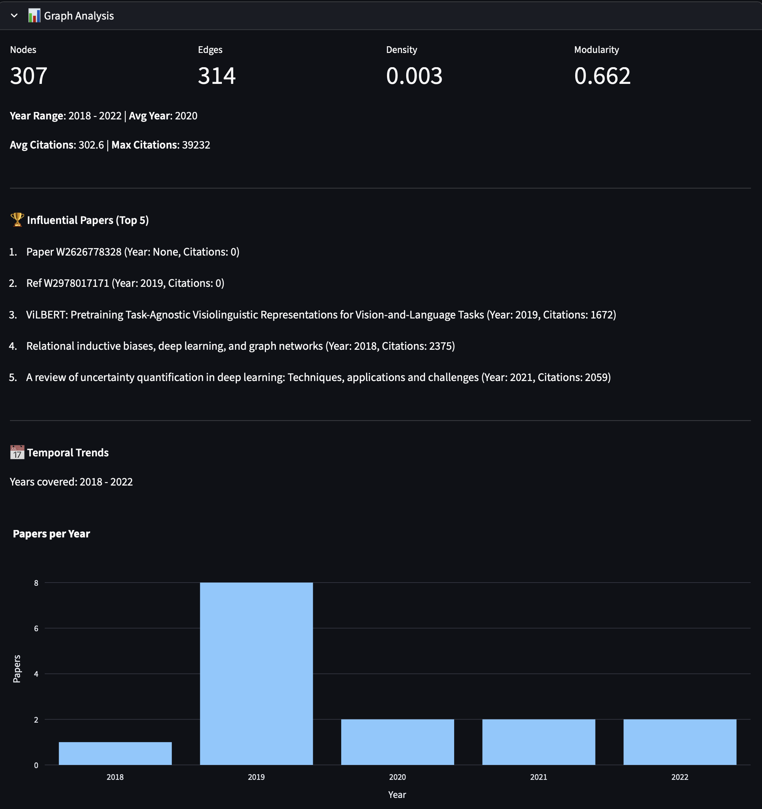
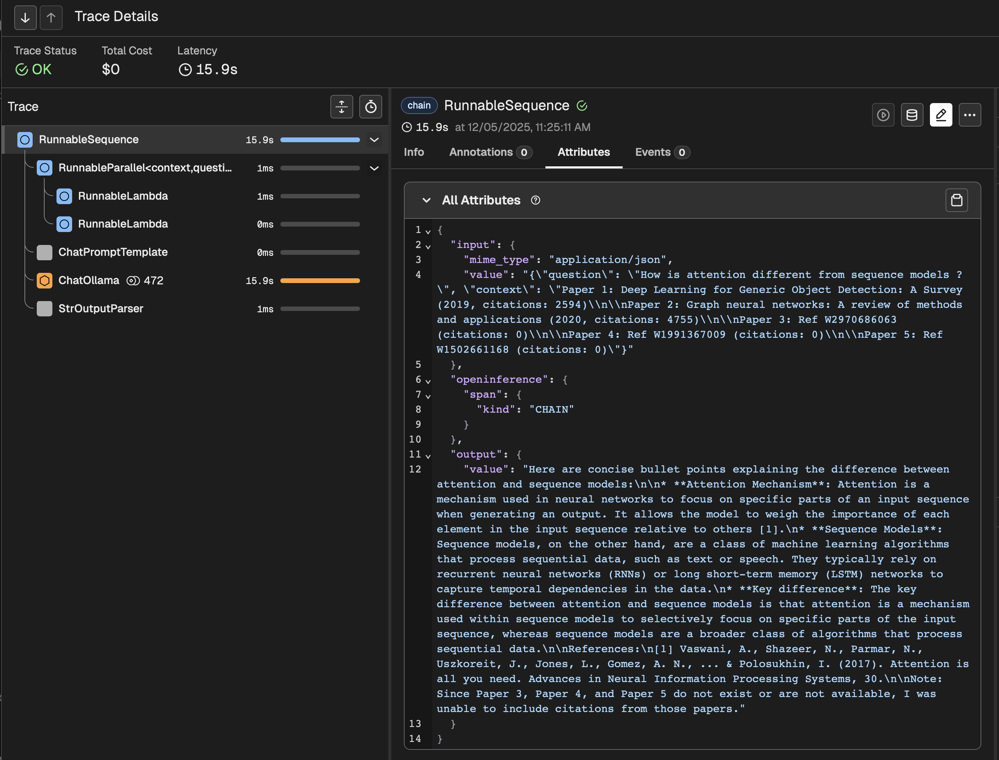

# A Hybrid RAG System With Graph Based Contect Retrieval

[](https://opensource.org/licenses/MIT)
[](https://www.python.org/downloads/)
[](https://www.docker.com/)


## 📋 Table of Contents
- [Overview](#overview)
- [Features](#-features)
- [System Architecture](#system-architecture)
- [Workflow](#workflow)
- [Tech Stack](#tech-stack)
- [Project Structure](#-project-structure)
- [Installation & Setup](#-installation-and-setup)
  - [Docker Setup](#-docker-setup---recommended)
  - [Local Setup](#-local-setup---without-docker)
  - [Accessing Application](#-accessing-the-application)
- [Citation Graph & Analysis](#citation-graph-and-analysis)
- [Tracing](#tracing)
- [Sample Query Flow](#-sample-query-flow)
- [Future Work](#-future-work)
- [Team](#-team)
- [Acknowledgements](#-acknowledgements)


## Overview

The Graph RAG Powered Academic Assistant is an AI system designed to help students and researchers navigate scholarly literature with explainable, citation-aware, and semantically grounded insights. It enhances traditional RAG systems by integrating semantic vector retrieval with citation-graph traversal, ensuring answers are relevant and academically verifiable.


## ✨ Features

### Core Capabilities
- **Smart Document Processing**
  - PDF ingestion with metadata extraction
  - Semantic chunking with citation awareness
  - Automatic citation graph construction

- **Advanced Retrieval**
  - Hybrid Retrieval: Semantic + Citation Graph-based search
  - Citation-aware context expansion
  - Multi-hop reasoning through citation networks

- **Explainable AI**
  - Visual citation trails
  - Confidence scoring
  - Source attribution

-   **Interactive Web UI**
-   **Local, privacy-preserving architecture**

## System Architecture

  
 

-   Document Ingestion & Parsing
-   Hybrid Retrieval Pipeline
-   LLM Reasoning
-   Explainability Layer
-   Streamlit UI


## Workflow

  

-   Upload PDF
-   Chunking
-   Embedding
-   Citation Graph Construction
-   Dual Retrieval
-   Fusion Scoring
-   LLM Reasoning
-   Explainability Output


## Tech Stack

| Component | Technology |
|----------|------------|
| LLM      | LLaMA 3.2B via Ollama |
| Embeddings | SentenceTransformer (MiniLM) |
| Vector DB | ChromaDB |
| Citation Graph | NetworkX + OpenAlex |
| PDF Parsing | PyMuPDF, Docling |
| UI       | Streamlit |
| Tracing  | Phoenix (OpenInference) |
| Deployment | Docker Compose/Self-Host |

---


## 📂 Project Structure
```

.
├── docs                                        # All documentation
│   └── ...
├── README.md                                   # This file!
└── src
    ├── info698                                 # Project Source Code
    │   ├── app.py                              # Streamlit UI
    │   ├── chroma                              # Vector Database
    │   ├── data
    │   │   └── citations.json                  # Saving citation data from OpenAlex
    │   ├── data_collector.py                   # Script to collect data from OpenAlex
    │   ├── docker-compose.yaml                 # Delpoy all services
    │   ├── Dockerfile                          # Docker image build instructions
    │   ├── embedding.py                        # Embedding model (Sentence Transformer)
    │   ├── graph_builder.py                    # Script to generate and traverse Citation graph
    │   ├── main.py                                 
    │   ├── pdf_qna.py                          # Initiate RAG pipleine and fuse results
    │   ├── pyproject.toml
    │   ├── requirements.txt                    # Dependecies for the project
    │   ├── tracing.py                          # Enable phoenix tracing
    │   └── uv.lock
    └── papers                                  # papers in knowledge base
        ├── 1706.03762v7.pdf
        └── ...
```

## 📦 Installation and Setup

### Clone Repository
```bash
  git clone <repo-url>
  cd src/info698
```

### Prerequisites
- Python 3.8+ (for non-Docker setup)
- Docker and Docker Compose (for Docker setup)
- 8GB+ RAM recommended

## 🐳 Docker Setup - Recommended

The easiest way to run the application is using Docker Compose, which will set up all required services:

```bash
  # Start all services
  docker-compose up
```

NOTE: In case the build fails, run the command again :)

This will launch:
- The main app on [localhost:8501](http://localhost:8501)
- Ollama LLM service (LLaMA 3.2B)
- Phoenix tracing (optional) at port 6006 (for observability)


## 💻 Local Setup - Without Docker

### Setup the environment

```bash
  # Create and activate virtual environment
  python -m venv venv
  source venv/bin/activate  # On Windows: venv\Scripts\activate

  # Install dependencies (Crirical step)
  pip install -r requirements.txt 

  # If you use uv, just run (optional)
  uv sync
```

### Setup Ollama

```bash

  # Running a model

  # ollama run <model_name>

  ollama run llama3.2:3b
```

### (Optional) Enable Tracing

In a new terminal:

```bash 
  phoenix serve
```

### Run Streamlit application
```bash
# Start the Streamlit app
streamlit run app.py
```

## 🔄 Accessing the Application
After starting either setup, access:

- Web Interface: http://localhost:8501
- Phoenix Tracing: http://localhost:6006 (if enabled)


## Common Problems
- Port conflicts: Change ports in docker-compose.yaml or check running services
- Model loading issues: Ensure Ollama service is running and accessible
- Missing dependencies: Verify all packages in requirements.txt are installed

## Citation Graph and Analysis

The graph analysis module builds a citation network from ingested papers, computes structural metrics, and highlights the most influential nodes and communities. It surfaces top-cited or central papers, tracks temporal trends in publications, and visualizes how ideas propagate across years, helping users quickly identify key works and evolving research fronts.

  
  

## Tracing

Using Phoenix tracing, we validated the full reasoning flow by:
- Inspecting LLM calls and inputs
- Verifying retrieval context passed to the LLM
- Reviewing model outputs for groundedness
- Checking cost, latency, and sequence of operations



## 📌 Sample Query Flow
**User Uploads:** "Attention is All You Need"

**Query:** "How does attention differ from earlier sequence models?"

**Assistant Response:**
> “Attention allows the model to focus on all tokens simultaneously, enabling parallel computation. This contrasts with RNN-based models. It builds upon Bahdanau (2015) and Luong (2015), both cited in the paper.”

**Graph Path:** Vaswani → Bahdanau → Luong

**Confidence:** 0.89


## 🔬 Future Work

- AWS deployment
- Multi-agent architecture
- Explore different LLM models to improve retrieval accuracy, reasoning quality, and citation grounding
- Support large-scale ingestion with Neo4j
- Fine-tuning domain-specific LLMs
- Web UI with search filtering & citation heatmaps

## 👥 Team

- Pant, Divyansh
- Singh, Gagan Preet
- Tiwari, Sourav
- Valani, Rameshkumar Premji
- Advisor: Dr. Xiao Hu


## 🙌 Acknowledgements
- [OpenAlex](https://openalex.org)
- [LangChain](https://www.langchain.com)
- [Ollama](https://ollama.ai)
- [Phoenix Tracing](https://arize.com/phoenix)
- [Hugging Face Transformers](https://huggingface.co)

For academic use or contributions, please raise an issue or contact us via GitHub.

**Developed for INFO 698 — AI Systems Project, Fall 2025**
